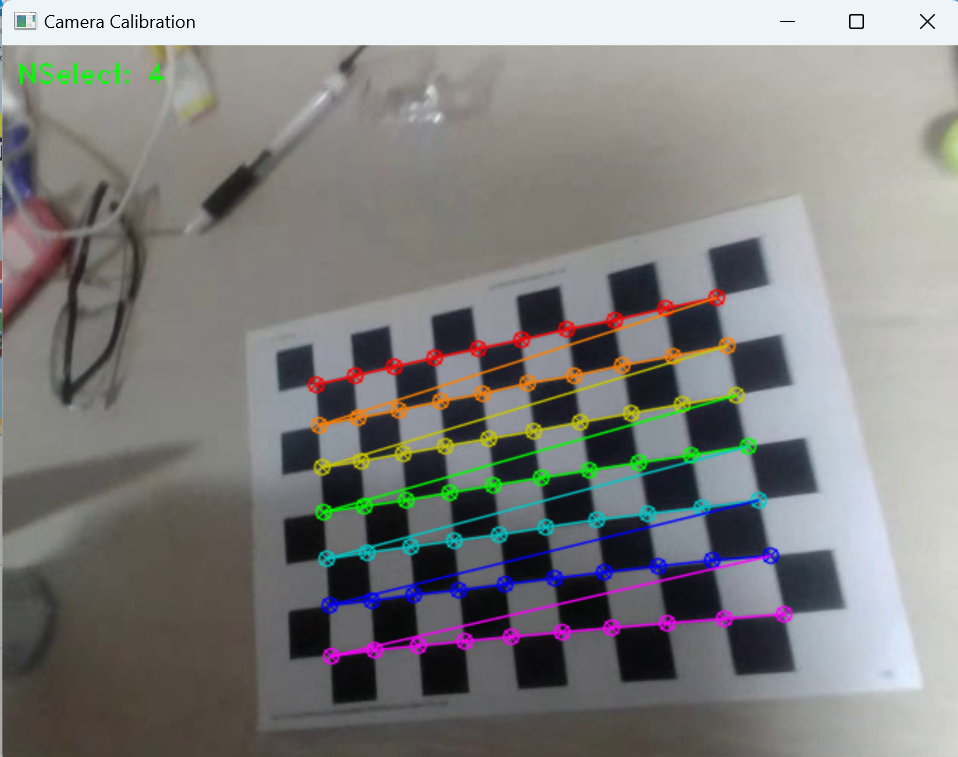

# Camera Calibration

Camera calibration with 10 x 7 checkboard and openCV (+ distortion correction)

## Prerequisite

You have to install openCV

```sh
pip install opencv-python opencv-contrib-python
```

## How to use

While your video is running

Press SPACE to pause video and show corners.

If you want to selcet that image for calibration, press ENTER.
(You can skip it, by pressing SPACE again)

terminal will show you the result of calibration

After calibration, You can watch distortion corrected video by pressing TAB

You can use your video. Put your video instead of mine

You can install checkerboard in [here](https://markhedleyjones.com/projects/calibration-checkerboard-collection)

## Sample
Calibration
  

  

Distortion correction


```sh
## Camera Calibration Results
* The number of selected images = 4
* RMS error = 0.7780109951315785
* Camera matrix (K) =
[[487.23845425   0.         313.56046526]
 [  0.         488.57774353 250.57225191]
 [  0.           0.           1.        ]]
* Distortion coefficient (k1, k2, p1, p2, k3, ...) = [ 0.06150379  0.41656602  0.00672558 -0.00329486 -1.3300801 ]
```

