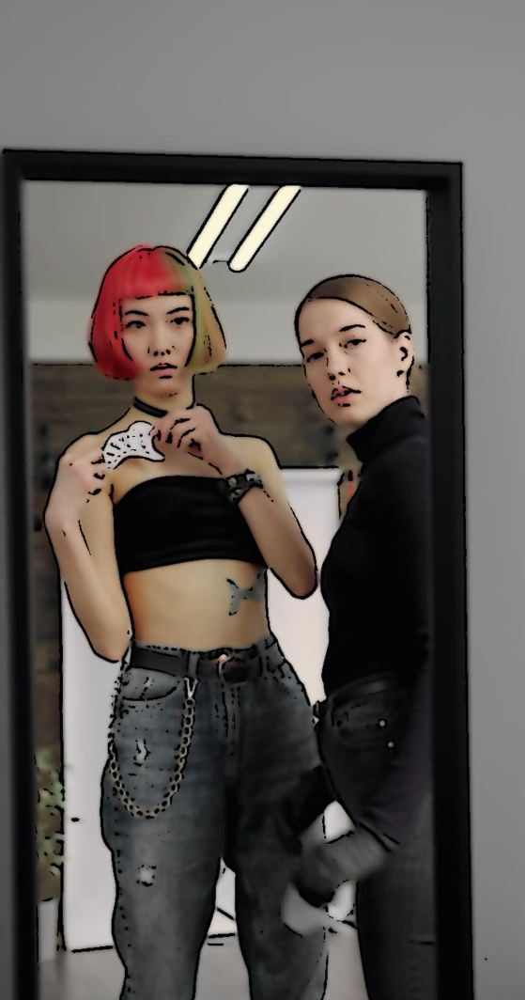
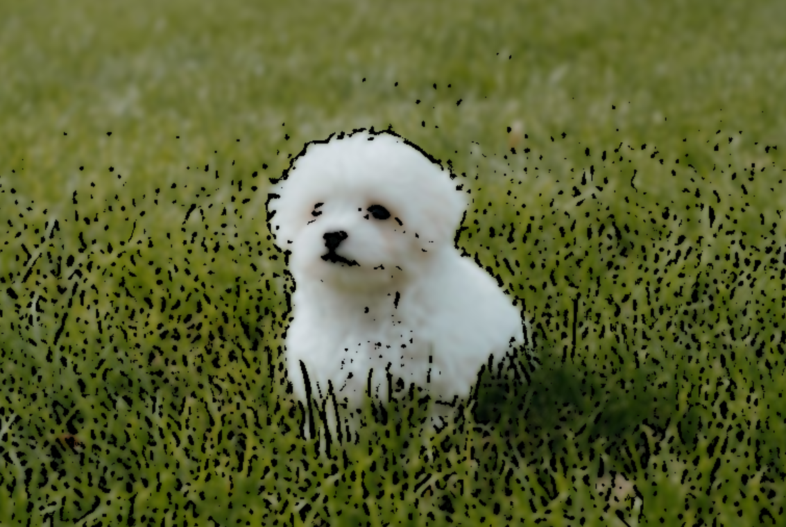

# Video Cartoonizer

Cartoonize your video or image

## Prerequisite

You have to install openCV

```sh
pip install opencv-python opencv-contrib-python
```

## How to use

If you input terminal 'v', you can cartoonize your video 

or you can input 'i' to cartoonize your image

Put your video in input folder and change path in code

Output will be recorded in output folder

You can watch sample video in output folder

Q : Quit

## Screenshots
sample1  


sample2  


sample3  


sample4  


## Limitation of algorithm

Since the edge is found by adaptive thresholding, it could not work well when edge part has similar color with its surround.

It blurs image before processing to reduce noise, but it can disturb finding edges. 

In sample 1 and 3, cartonize works well, but there are not many difference in sample 2 and 4