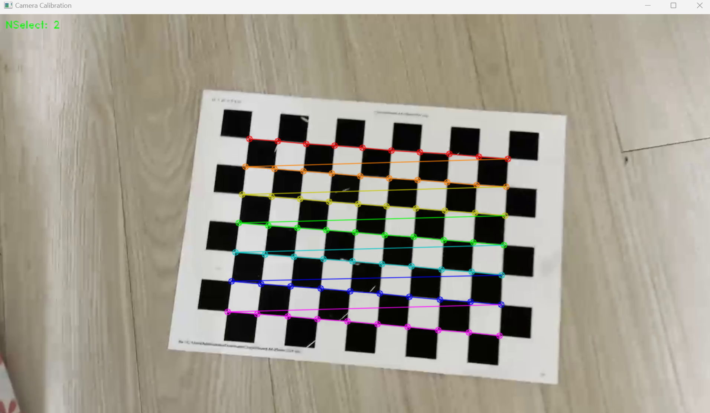
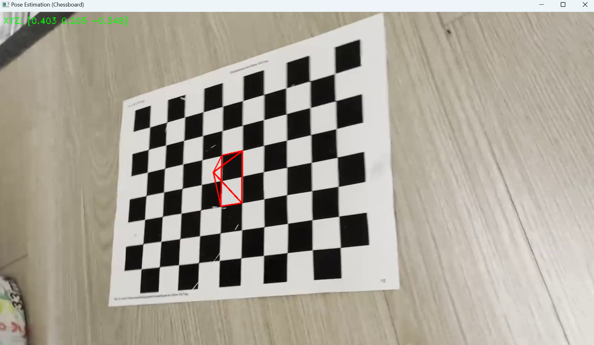
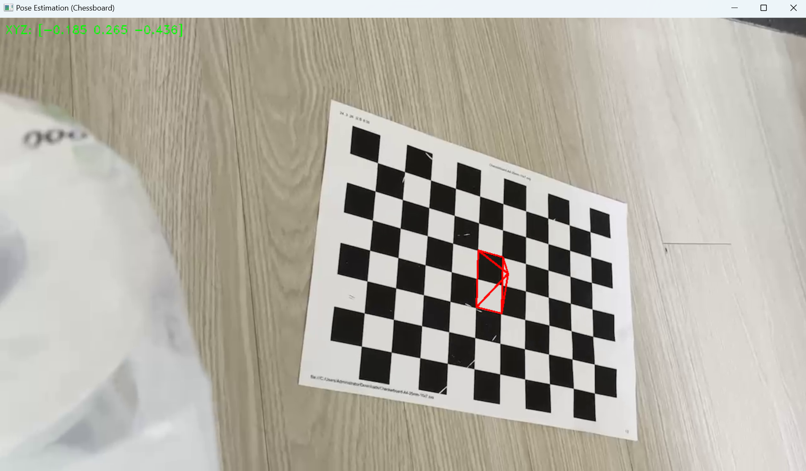

# Pose Estimation with AR

Get camera pose using calibration and draw pyramid on the video.

## Prerequisite

You have to install openCV

```sh
pip install opencv-python opencv-contrib-python
```

## How to use

While your video is running

Press SPACE to pause video. You can see corners of board.

If you want to selcet that image for calibration, press ENTER.
(You can skip it, by pressing SPACE again)

After calibration, video will played with pyramid on the center of board.

You can pause the video with 'SPACE' and escape with 'ESC'

You can use your video. Put your video instead of mine

## Sample
Calibration
  

Pyramid AR
  



