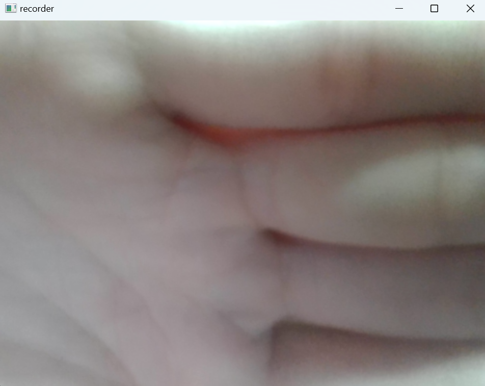
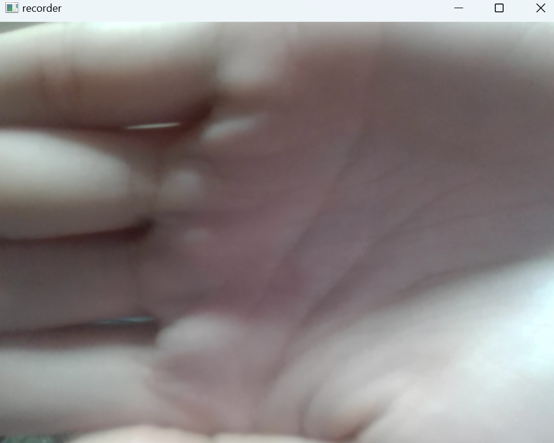
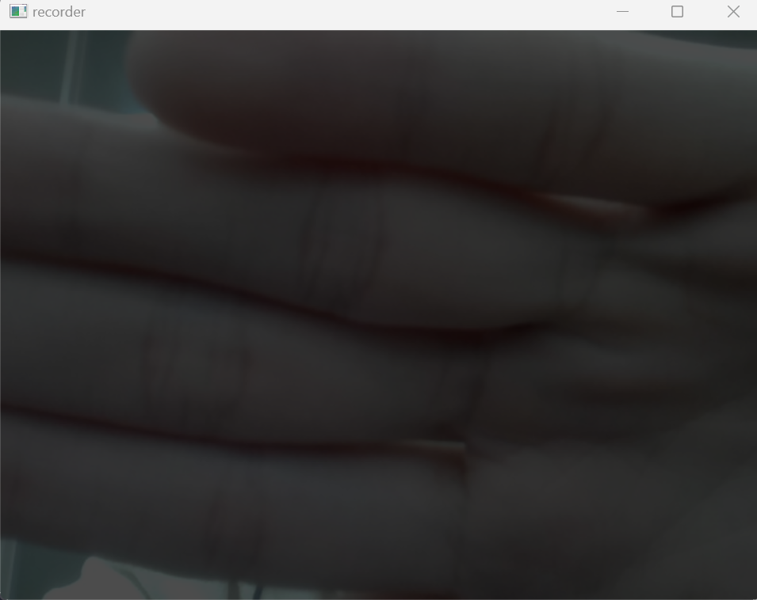
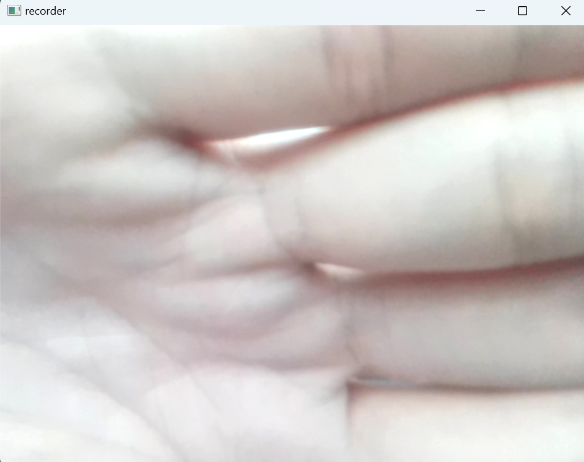

# OpenCV_recorder

Simple video recorder with openCV

## Prerequisite

You have to install openCV

```sh
pip install opencv-python opencv-contrib-python
```

## How to use

ESC : Exit program

R : Flip camera

Space bar : Record 

1 / 2 : adjust contrast

3 / 4 : adjust brightness

While recording, red dot appears on the top left.


## Screenshots
preview mode


flipped screen


recording 


low contrast


high brightness
